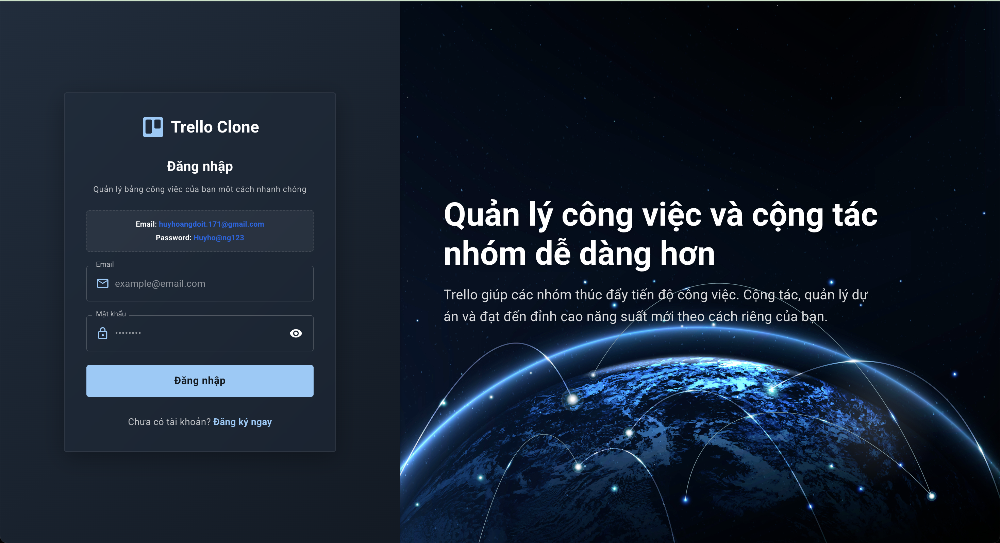
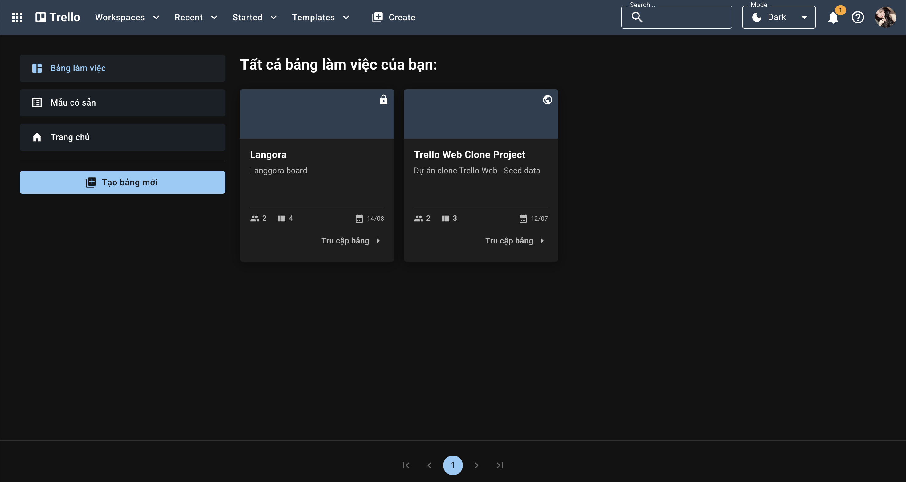
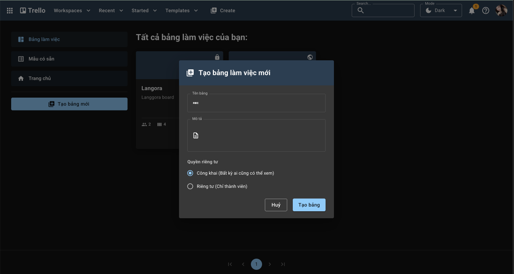
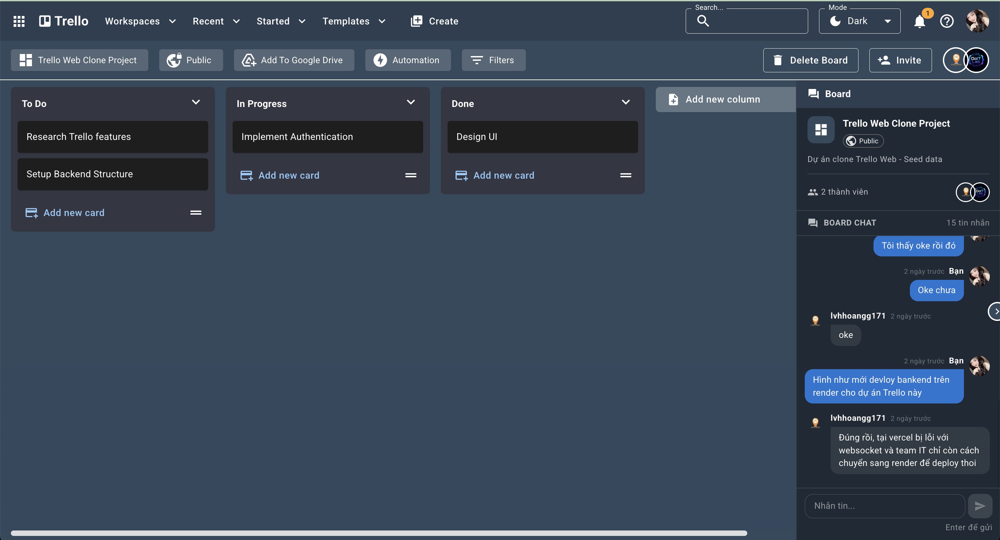
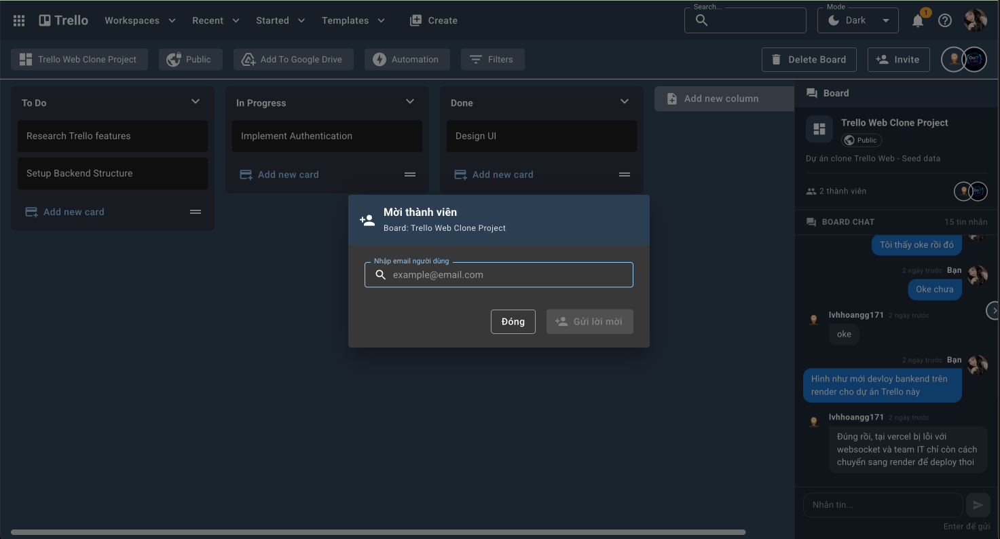
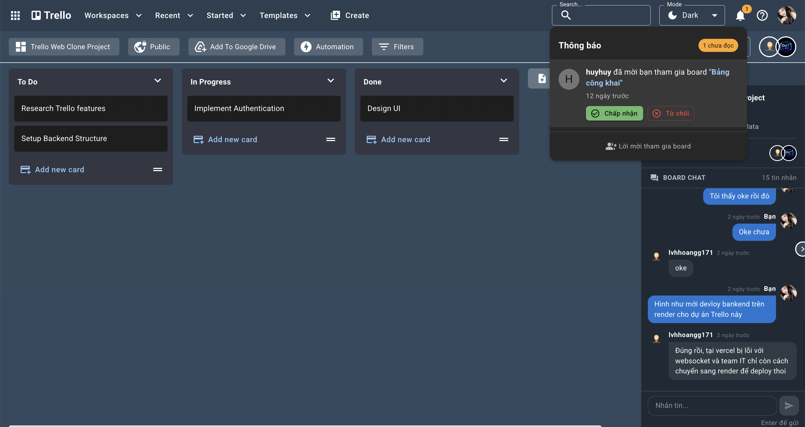
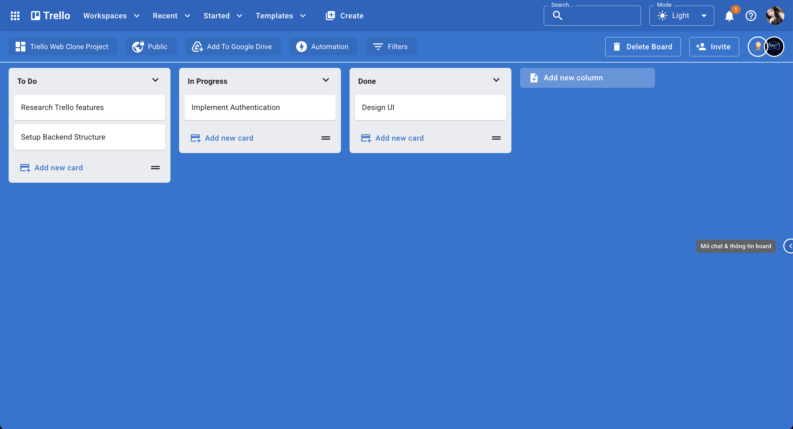

# 🔷🔷 Trello Clone - Hệ thống Quản lý Dự án Kanban

<div align="center">

**Ứng dụng quản lý công việc và dự án trao đổi real-time**

[](https://react.dev/)
[](https://vitejs.dev/)
[](https://nodejs.org/)
[](https://www.mongodb.com/)
[](https://socket.io/)

</div>

## 📋 Mục lục

- [Giới thiệu](#-giới-thiệu)
- [Tính năng](#-tính-năng)
- [Công nghệ sử dụng](#-công-nghệ-sử-dụng)
- [Cấu trúc dự án](#-cấu-trúc-dự-án)
- [Hình ảnh](#-hình-ảnh)

## 🎯 Giới thiệu

**Trello Clone** là một ứng dụng quản lý dự án và công việc theo phương pháp Kanban. Hệ thống tập trung vào trải nghiệm người dùng với thao tác kéo thả mượt mà, đồng thời cập nhật trao đổi nhóm trong dự án theo thời gian thực.

### Điểm nổi bật

- 🚀 **Kéo thả mượt mà** - Trải nghiệm Drag & Drop nâng cao với @dnd-kit
- ⚡ **Real-time chat** - Đồng bộ trao đổi trong dự án tức thời với Socket.io
- 🎨 **Giao diện trực quan** - Chuẩn Material Design với MUI v5
- 🌓 **Dark/Light Mode** - Hỗ trợ chế độ sáng/tối linh hoạt
- 👥 **Quản lý lời mời** - Gửi lời mời tham gia dự án, nhận thông báo.
- 📱 **Responsive** - Tối ưu cho mọi kích thước thiết bị
- 🔒 **Bảo mật** - JSON Web Token (JWT) và mã hóa mật khẩu bcrypt

## ✨ Tính năng

### Xác thực & Người dùng
- ✅ Đăng nhập / Đăng ký tài khoản
- ✅ Đổi ảnh đại diện, cập nhật thông tin hồ sơ
- ✅ Quản lý phiên làm việc bằng JWT an toàn
- ✅ Phân quyền bảo mật giữa các Board

### Quản lý Bảng (Board)
- ✅ Tạo, xem và quản lý các Board cá nhân
- ✅ Bình luận & Thảo luận trong dự án
- ✅ Mời thành viên (Gửi email qua Brevo & In-app Notification)
- ✅ Quản lý thành viên trong bảng
- ✅ Real-time Notification khi có người thao tác hoặc gửi lời mời

### Quản lý Cột & Thẻ (Column & Card)
- ✅ Thêm mới Cột và Thẻ công việc
- ✅ Chỉnh sửa thông tin, đặt ngày hết hạn (Due Date)
- ✅ Kéo thả Thẻ giữa các Cột hoặc sắp xếp lại thứ tự Cột (Drag & Drop)

## 🛠 Công nghệ sử dụng

### ✨ Frontend (Trello Web)
- **React.js 18** - UI Library
- **Vite** - Build tool siêu tốc
- **Redux Toolkit & React Redux** - State management
- **React Router DOM** - Routing
- **@dnd-kit** - Thư viện Kéo thả (Drag & Drop)
- **Material UI (MUI v5) & Emotion** - UI Components & Styling
- **Socket.io-client** - Real-time communication
- **Axios** - HTTP client
- **React Hook Form** - Form validation
- **Lodash** - Utility functions

### 🚀 Backend (Trello API)
- **Node.js 20 & Express.js** - Runtime environment & Framework
- **MongoDB** - Cơ sở dữ liệu NoSQL (Native MongoDB Driver)
- **Socket.io** - WebSocket Real-time server
- **JWT** - Authentication & Session management
- **Bcryptjs** - Password hashing
- **Joi** - Validation schema đầu vào
- **Cloudinary & Multer** - Upload & Tối ưu hóa file media
- **Brevo** - Dịch vụ gửi Email tự động
- **Babel** - Trình biên dịch mã nguồn

## 📁 Cấu trúc dự án

Dự án được phân chia thư mục theo chuẩn MVC cho Backend và Component-based cho Frontend.

```
trello-clone/
├── trello-api/                 # BACKEND SYSTEM
│   ├── src/
│   │   ├── config/             # Cấu hình môi trường, database, cors
│   │   ├── controllers/        # Xử lý logic Request/Response
│   │   ├── middlewares/        # JWT Auth, Validation, Upload
│   │   ├── models/             # Schema & tương tác MongoDB
│   │   ├── routes/             # Định nghĩa API Endpoints
│   │   ├── services/           # Business logic (Board, Card, Column)
│   │   ├── sockets/            # Socket.io Server (User Room, Board Room)
│   │   ├── utils/              # Helper functions, formatter
│   │   └── server.js           # Entry point Backend
│   └── package.json
│
├── trello-web/                 # FRONTEND SYSTEM
│   ├── src/
│   │   ├── assets/             # Hình ảnh, icon tĩnh
│   │   ├── components/         # Reusable UI Components
│   │   ├── customHooks/        # Custom React Hooks
│   │   ├── pages/              # Các trang chính (Board, Auth, Profile)
│   │   ├── redux/              # Store, Actions, Slices (State Management)
│   │   ├── theme/              # Cấu hình Material UI Theme (Dark/Light)
│   │   ├── utils/              # Formatters, Constants, Axios instance
│   │   ├── socket.js           # Socket.io Client (Singleton)
│   │   ├── App.jsx             # Component Gốc
│   │   └── main.jsx            # Entry point Frontend
│   └── package.json
│
└── screenshot/                 # Thư mục lưu trữ hình ảnh minh họa
```

## 🖼 Hình ảnh

### Màn hình Đăng Nhập


### Màn hình List Boards




### Màn hình Chi Tiết Board (Card Detail)
> Hiển thị thông tin chi tiết board, columns, cards, bình luận (chat)






### Dark Mode / Light Mode
> Chuyển đổi linh hoạt theo sở thích người dùng.


---

<div align="center">

**Nếu bạn thấy dự án hữu ích, hãy cho một ⭐ trên GitHub nhé!**

</div>